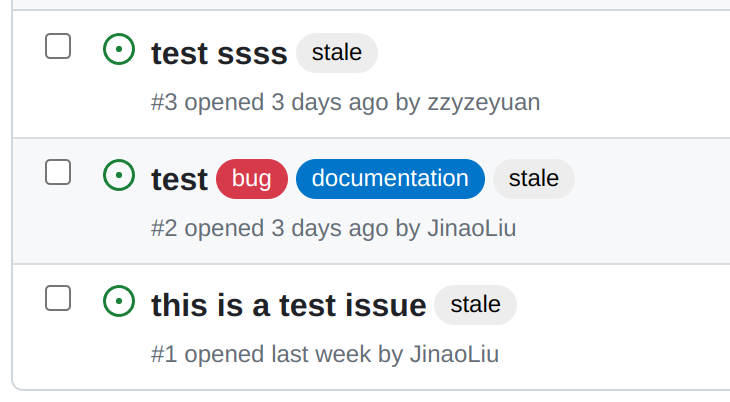
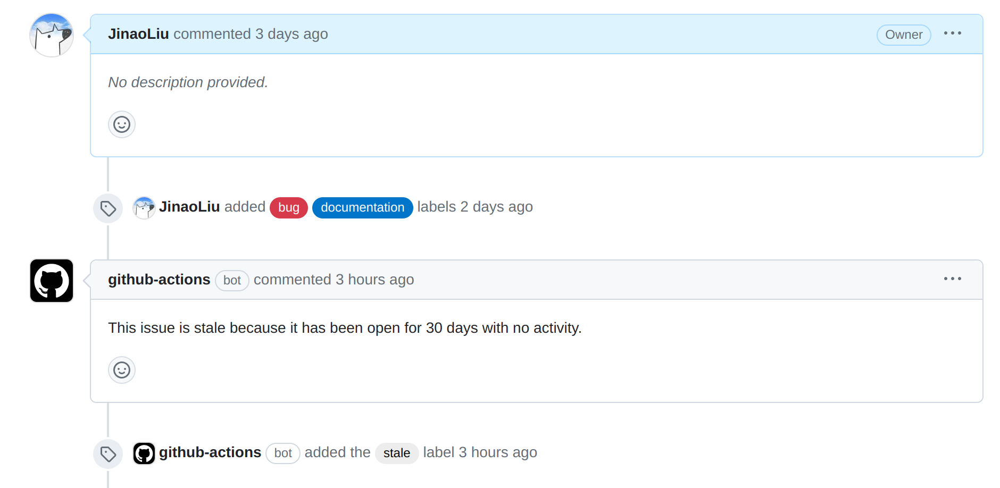

# &#x1F3AF;&#x1F3AF;&#x1F3AF; GitHub Actions使用

## &#x1F449; GitHub Actions介绍

具体关于这一块的介绍, 就不细说了, 这里列出两个资源, 特别是GitHub自己的官方文档关于GitHub Actions的使用写的非常详细.

- https://docs.github.com/zh/actions/learn-github-actions
- https://www.bilibili.com/video/BV1RE411R7Uy

## &#x1F680;&#x1F680;&#x1F680;我的练习

我设计的功能是: 30天内不活跃的issue将会被关闭. 

这里为了测试方便, 将时间改为1天. 如下图所示, 当issue超过30天不活跃, 则会被打上stale的标签, 并提醒该issue. 在被打上stale标签之后的30天后, 将自动关闭该issue.





**以下是代码实现.**

```yaml
name: Close inactive issues
on:
  schedule:
    - cron: "30 1 * * *"

jobs:
  close-issues:
    runs-on: ubuntu-latest
    permissions:
      issues: write
      pull-requests: write
    steps:
      - uses: actions/stale@v5
        with:
          days-before-issue-stale: 30
          days-before-issue-close: 30
          stale-issue-label: "stale"
          stale-issue-message: "This issue is stale because it has been open for 30 days with no activity."
          close-issue-message: "This issue was closed because it has been inactive for 14 days since being marked as stale."
          days-before-pr-stale: -1
          days-before-pr-close: -1
```


